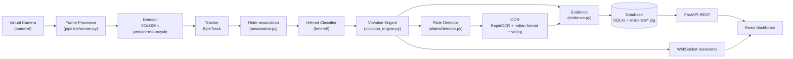
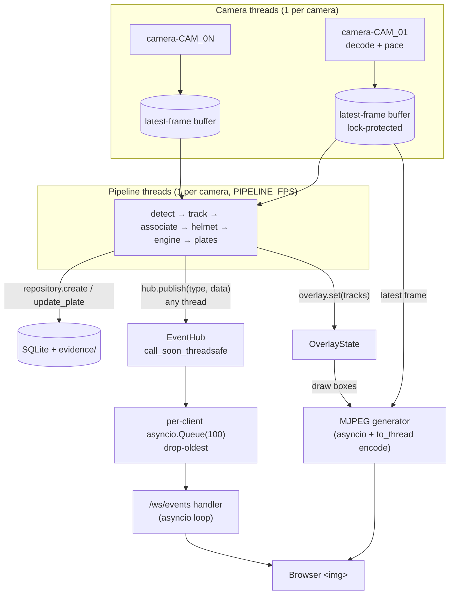
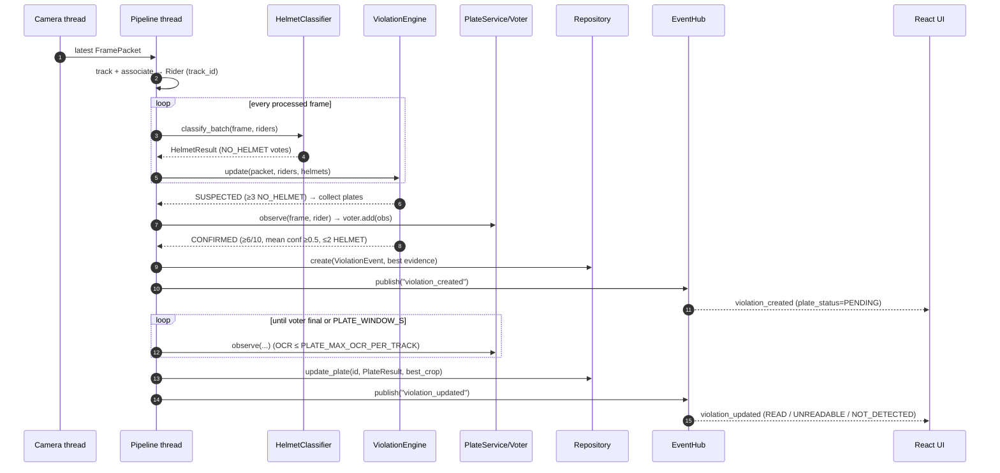
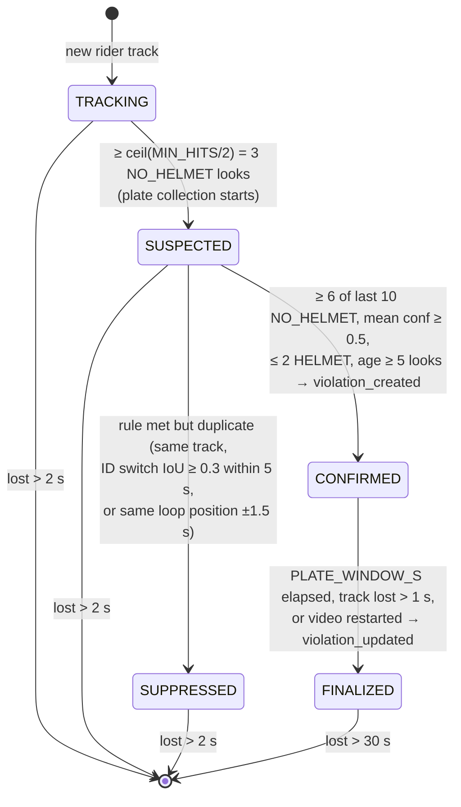

# Architecture

> **Live code map (Graphify): repository structure, module dependencies and ownership communities** →
> [graphify-out/graph.html](../graphify-out/graph.html) (open locally in a browser) ·
> report: [graphify-out/GRAPH_REPORT.md](../graphify-out/GRAPH_REPORT.md).
> The Mermaid diagrams below are the *designed* views (they describe code that does not exist yet);
> the Graphify map is the *generated* view of the code as it is. Marc regenerates it on `main` after merges.

## 1. Overview

A **modular monolith** ([ADR 0001](adr/0001-marc-modular-monolith.md)): one FastAPI process, one thread per
camera for decoding, one thread per camera for processing, SQLite + local filesystem for storage, and a React
dashboard. No Docker, Redis, Kafka, microservices or cloud.

Four prerecorded videos (`videos/camera_01.mp4` … `camera_04.mp4`) act as live "virtual cameras". The
browser receives video as **MJPEG** and every event over **one WebSocket**
([ADR 0002](adr/0002-marc-mjpeg-plus-single-websocket.md)). Model choices: [ADR 0003](adr/0003-marc-model-choices.md),
[MODELS.md](MODELS.md).

Modules (backend/app/) and owners:

| Module | Owner | Responsibility |
|---|---|---|
| `core/` | Marc | Contracts: `types.py`, `schemas.py`, `interfaces.py`, `geometry.py` |
| `camera/` | Marc (Codex stream) | Video sources, latest-frame buffers, MJPEG |
| `storage/` | Marc (Codex stream) | SQLite repository, evidence JPEGs |
| `helmet/` | Prajwal | Helmet head-detector on rider crops |
| `plates/` | Malik | Plate detector, RapidOCR, Indian-format correction, voting |
| `pipeline/` | Marc | Detector + tracker, rider association, violation engine, evidence, runners |
| `realtime/`, `api/` | Marc | EventHub, REST, WebSocket |
| `container.py` | Marc | Composition root: the only file importing every module |

## 2. Detection pipeline



## 3. Threading and data flow



Rules that keep this safe:

* Frames are immutable (`FramePacket.image` is read-only); whoever draws, copies.
* Only `EventHub.publish` crosses from threads into asyncio; it never blocks.
* Slow WebSocket clients lose the oldest messages, never stall the pipeline.
* MJPEG pulls the *latest* frame; there is no frame queue to grow unboundedly.

## 4. Sequence: from rider to UI



## 5. Violation lifecycle (as built)



Changes from the original plan: there is no separate PLATE_PENDING state (CONFIRMED *is* the plate-pending phase:
the stored violation has `plate_status: PENDING` until FINALIZED), and dedup happens *before* anything is emitted
(SUSPECTED → SUPPRESSED), so a duplicate never reaches the database. Full rules, config keys and examples:
[docs/modules/pipeline.md §7](modules/pipeline.md#7-algorithms--design-decisions); ADRs
[0005](adr/0005-marc-confirmation-rule.md), [0006](adr/0006-marc-dedup-and-loop-guard.md).
The "same loop position" rule exists because the virtual cameras loop: the same rider reappears every loop
and must not create a new violation each time.

**Performance (measured, CPU i5-8350U, no GPU):** YOLO26n tracking 98-260 ms/frame for imgsz 416-640; the CPU tops
out at ~7 detector inferences/s in total, so 4 cameras run at ~2 FPS each. Use a GPU for 4 cameras at ≥ 4 FPS, or
2-3 cameras on CPU. Details: [pipeline.md §9](modules/pipeline.md#9-performance).

## 6. Modes

| `APP_MODE` | Runner | Models | Use |
|---|---|---|---|
| `mock` | `MockRunner` | none (all `MOCK`) | develop API/UI without ML; clearly-labelled UI walkthrough |
| `live` | `PipelineRunner` | loaded by factories; missing ones report `NOT_LOADED` | the real demo |

Factories never raise: a missing weight file or package yields a fallback with `state=NOT_LOADED|ERROR`
and `/api/health` reports `degraded`. Missing videos fall back to a synthetic pattern.

## 7. Composition

`container.py` builds everything in this order and is the only place that knows concrete classes:

```
Settings → create_camera_manager → create_repository → EventHub
        → live:  load_helmet_classifier, load_plate_service, PipelineRunner
        → mock:  MockRunner
```

## 8. Graphify

`graphify-out/` is generated by running `graphify .` (or `/graphify .` in Claude Code) at the repo root.
Only `graph.html`, `graph.json` and `GRAPH_REPORT.md` are committed, only by Marc, only on `main`.
Ignored inputs are listed in [`.graphifyignore`](../.graphifyignore).
