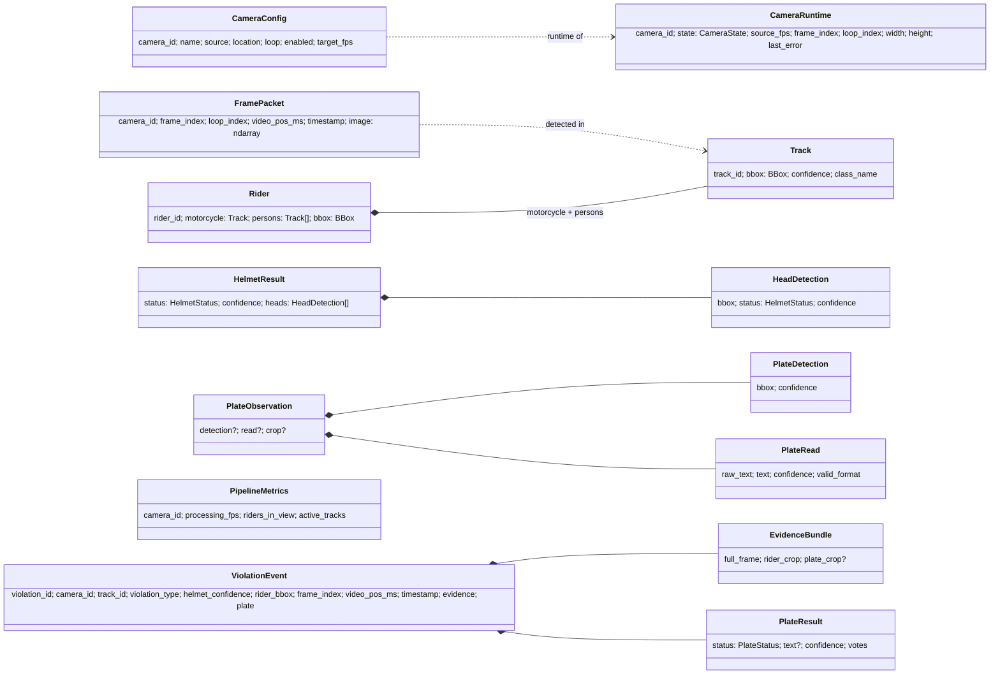

# Contracts

Owner: **Marc**. The contract is three files that always change together, in a dedicated
`contracts/<desc>` PR (see [CONTRIBUTING.md](../CONTRIBUTING.md#contract-changes)):

| File | What |
|---|---|
| [`backend/app/core/types.py`](../backend/app/core/types.py) | In-process dataclasses + enums |
| [`backend/app/core/schemas.py`](../backend/app/core/schemas.py) | Pydantic wire schemas (REST + WS) |
| [`backend/app/core/interfaces.py`](../backend/app/core/interfaces.py) | `Protocol`s each module implements |
| [`frontend/src/types/contracts.ts`](../frontend/src/types/contracts.ts) | TypeScript mirror of `schemas.py` |

Conventions: `BBox = (x1, y1, x2, y2)` in original-frame pixels; timestamps on the wire are ISO-8601 UTC;
enums travel as their string values.

## Core types



Enums: `CameraState` (STARTING, ONLINE, OFFLINE, STOPPED) · `HelmetStatus` (HELMET, NO_HELMET, UNKNOWN) ·
`PlateStatus` (PENDING, READ, UNREADABLE, NOT_DETECTED) · `ModelState` (LOADED, MOCK, NOT_LOADED, ERROR).

## Protocols (interfaces.py)

| Protocol | Implemented by | Used by |
|---|---|---|
| `CameraManagerProtocol` | `camera.manager.CameraManager` | container, runners, api/cameras |
| `ViolationRepositoryProtocol` | `storage.repository.SqliteViolationRepository` (pending), `InMemoryRepository` | runners, api/violations |
| `HelmetClassifierProtocol` | `helmet.classifier.YoloHelmetClassifier` (pending), `helmet.mock.*` | PipelineRunner |
| `PlateServiceProtocol` / `PlateVoterProtocol` | `plates.service.PlateService` / `plates.voting.PlateVoter` (pending), `plates.mock.*` | PipelineRunner |
| `EventPublisherProtocol` | `realtime.hub.EventHub` | runners, container |
| `OverlayFn` | `pipeline.overlay.OverlayState` | camera manager (MJPEG) |

## REST endpoints

| Method | Path | Response | Notes |
|---|---|---|---|
| GET | `/api/health` | `HealthOut` | `status` = `degraded` if a camera is OFFLINE or (live) a model is not LOADED |
| GET | `/api/cameras` | `CameraOut[]` | config order |
| GET | `/api/cameras/{camera_id}` | `CameraOut` | 404 unknown |
| GET | `/api/cameras/{camera_id}/stream.mjpg` | `multipart/x-mixed-replace` | overlay drawn; `STREAM_FPS`, `STREAM_WIDTH`, `STREAM_JPEG_QUALITY` |
| GET | `/api/cameras/{camera_id}/snapshot.jpg` | `image/jpeg` | 503 before first frame |
| GET | `/api/violations?camera_id=&limit=50&offset=0` | `ViolationPage` | newest first; `limit` 1-200 |
| GET | `/api/violations/{id}` | `ViolationOut` | 404 unknown |
| GET | `/api/stats` | `StatsOut` | same payload as the `stats` WS message |
| GET | `/evidence/{camera_id}/{violation_id}/{kind}.jpg` | `image/jpeg` | static files from `EVIDENCE_DIR` |
| WS | `/ws/events` | `WsEnvelope` stream | see below |

## WebSocket messages (`/ws/events`)

Every message is a `WsEnvelope`: `{"type": ..., "ts": "<ISO UTC>", "data": {...}}`. On connect the server
sends `hello`, then one `camera_status` per camera, then live messages. Clients send nothing.

| type | data | When |
|---|---|---|
| `hello` | `{mode, version, cameras: string[]}` | once, first |
| `camera_status` | `CameraOut` | on connect (per camera) and on every camera state change |
| `camera_metrics` | `CameraMetricsMsg` | ~2 Hz per camera |
| `violation_created` | `ViolationOut` (`plate_status: PENDING`) | violation confirmed |
| `violation_updated` | `ViolationOut` | plate result final |
| `stats` | `StatsOut` | every 5 s |

Examples:

```json
{"type": "hello", "ts": "2026-10-07T10:00:00Z", "data": {"mode": "mock", "version": "0.1.0", "cameras": ["CAM_01", "CAM_02", "CAM_03", "CAM_04"]}}
```

```json
{"type": "camera_status", "ts": "2026-10-07T10:00:00Z", "data": {"camera_id": "CAM_01", "name": "MG Road Junction", "location": "MG Road", "state": "ONLINE", "source_fps": 15.0, "processing_fps": 5.0, "frame_index": 1234, "riders_in_view": 2, "stream_url": "/api/cameras/CAM_01/stream.mjpg", "snapshot_url": "/api/cameras/CAM_01/snapshot.jpg", "last_error": null}}
```

```json
{"type": "camera_metrics", "ts": "2026-10-07T10:00:01Z", "data": {"camera_id": "CAM_01", "processing_fps": 5.02, "riders_in_view": 1, "tracks": [{"track_id": 17, "bbox": [412, 300, 566, 573], "helmet": "NO_HELMET"}]}}
```

```json
{"type": "violation_created", "ts": "2026-10-07T10:00:02Z", "data": {"id": "3f9c0d0e8b0a4c1e9a5b2f6d7c8e9f01", "camera_id": "CAM_01", "track_id": 17, "violation": "NO_HELMET", "plate": null, "plate_status": "PENDING", "plate_confidence": null, "helmet_confidence": 0.87, "timestamp": "2026-10-07T10:00:02.120000Z", "frame_index": 1250, "rider_bbox": [412, 300, 566, 573], "evidence": {"full_frame_url": "/evidence/CAM_01/3f9c0d0e8b0a4c1e9a5b2f6d7c8e9f01/full_frame.jpg", "rider_crop_url": "/evidence/CAM_01/3f9c0d0e8b0a4c1e9a5b2f6d7c8e9f01/rider_crop.jpg", "plate_crop_url": null}}}
```

```json
{"type": "violation_updated", "ts": "2026-10-07T10:00:04Z", "data": {"id": "3f9c0d0e8b0a4c1e9a5b2f6d7c8e9f01", "camera_id": "CAM_01", "track_id": 17, "violation": "NO_HELMET", "plate": "KA01AB1234", "plate_status": "READ", "plate_confidence": 0.93, "helmet_confidence": 0.87, "timestamp": "2026-10-07T10:00:02.120000Z", "frame_index": 1250, "rider_bbox": [412, 300, 566, 573], "evidence": {"full_frame_url": "/evidence/CAM_01/3f9c0d0e8b0a4c1e9a5b2f6d7c8e9f01/full_frame.jpg", "rider_crop_url": "/evidence/CAM_01/3f9c0d0e8b0a4c1e9a5b2f6d7c8e9f01/rider_crop.jpg", "plate_crop_url": "/evidence/CAM_01/3f9c0d0e8b0a4c1e9a5b2f6d7c8e9f01/plate_crop.jpg"}}}
```

```json
{"type": "stats", "ts": "2026-10-07T10:00:05Z", "data": {"total_violations": 12, "violations_by_camera": {"CAM_01": 4, "CAM_02": 3, "CAM_03": 2, "CAM_04": 3}, "plates_read": 9, "plates_unreadable": 2, "riders_in_view": 6, "cameras_online": 4, "cameras_total": 4, "uptime_s": 312.4}}
```

`GET /api/health` example:

```json
{"status": "ok", "mode": "mock", "models": {"detector": "MOCK", "helmet": "MOCK", "plate_detector": "MOCK", "ocr": "MOCK"}, "version": "0.1.0"}
```
