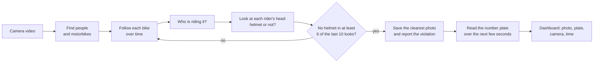

# How it decides: a one-page explainer

> Prototype for demonstration. Detections are probabilistic and require human review; not admissible enforcement evidence.

**From camera to evidence.** Each of the four cameras is a recorded road video played in real time. A few times
per second the system finds every person and motorbike in the picture and gives each bike a number that follows
it from frame to frame. People sitting on a bike are grouped with it as one "rider" (a passenger counts too).

**Why it never fires on a single frame.** For every rider the helmet model answers "helmet", "no helmet" or
"can't tell" on each look. One look can be wrong: a head turned away, motion blur, someone partly hidden. So the
system only reports a violation when **at least 6 of the last 10 looks say "no helmet"**, the model is fairly
sure on average, and it saw a helmet no more than twice. Riders that are too small or far away don't vote at all.
Each rider can produce one violation only, even if the tracker loses and re-finds them, or the video loops.

**The photo.** While a rider looks suspicious, the system keeps the single best picture: the sharpest,
largest view, not cut off at the edge. That photo is saved with a red box and the confidence.

**The number plate.** The plate is read from the bike's area over several frames, starting before the violation
is confirmed (bikes are often closest then). Each reading is corrected to the Indian plate format (for example a
letter O read where a digit must be becomes 0), and the readings vote. The result is either the plate text,
"unreadable" (a plate was seen but no reading was trustworthy) or "not detected".

**What the numbers mean.** "Helmet confidence 0.87" is the model's average certainty across the "no helmet" looks,
not a probability of guilt. "Plate confidence" is how strongly the readings agreed. Low values mean a human should
look more carefully.

**Privacy.** Everything runs on this laptop; nothing is uploaded. Only confirmed violations are stored (three
photos and a record), and they are deleted automatically after 7 days. Video, photos and databases are never put
in the code repository. A human always reviews the result; the system never issues fines.
