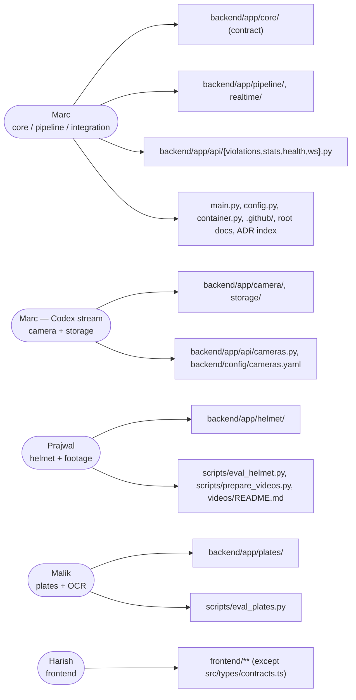

# Ownership

GitHub handles: Marc `@marcpedrin` · Prajwal `@prajwal-gh` · Malik `@malik-gh` · Harish `@harish-gh`
(**TODO**: replace the three placeholders here, in `.github/CODEOWNERS` and in the README).

## Summary table

| Dev | Owns | Inputs | Outputs | Tests | Open PR when |
|---|---|---|---|---|---|
| Marc | main/config/container, core (contract), pipeline, realtime, api/{violations,stats,health,ws}, CI, root docs, docs/modules/{pipeline,realtime-api}.md, ADRs index | FramePackets, HelmetResults, PlateObservations | ViolationEvents, WS messages, REST | tests/pipeline, tests/api | pipeline runs on one real video |
| Marc (Codex stream) | camera/, storage/, api/cameras.py, config/cameras.yaml, docs/modules/{camera,storage}.md | cameras.yaml, MP4s, ViolationEvents | FramePackets, MJPEG, ViolationOut + JPEGs | tests/camera, tests/storage | 4 real videos stream + SQLite repo passes tests |
| Prajwal | helmet/, scripts/eval_helmet.py, scripts/prepare_videos.py, videos/README.md, docs/modules/{helmet,footage}.md | frame + Riders | HelmetResult list | tests/helmet | eval report on our footage + tests green |
| Malik | plates/, scripts/eval_plates.py, docs/modules/plates.md | frame + Rider | PlateObservation, PlateResult via voter | tests/plates | eval report on our footage + tests green |
| Harish | frontend/** (except types/contracts.ts), docs/modules/frontend.md | REST + WS + MJPEG | Dashboard UI | vitest + build | each page works against mock mode |

## Per-developer detail

### Marc — core, pipeline, integration (`feature/pipeline`, `feature/integration`)

| | |
|---|---|
| **WHAT I OWN** | `backend/app/{main,config,container}.py`, `backend/app/core/**`, `backend/app/pipeline/**`, `backend/app/realtime/**`, `backend/app/api/{__init__,violations,stats,health,ws}.py`, `backend/tests/{pipeline,api}/**`, `.github/**`, root docs (README, CONTRIBUTING, docs/*.md), `docs/modules/{pipeline,realtime-api}.md`, `frontend/src/types/contracts.ts`, `scripts/{download_models,smoke_test,check_docs}.py`, `graphify-out/` |
| **MAY MODIFY** | Wiring lines in `container.py` for any module; `.env.example` (new keys) |
| **MUST NOT MODIFY** | Bodies of `camera/`, `storage/`, `helmet/`, `plates/`, `frontend/**` (except `contracts.ts`) |
| **INPUTS** | `FramePacket` (camera), `HelmetResult` (helmet), `PlateObservation`/`PlateResult` (plates) |
| **OUTPUTS** | `ViolationEvent` → repository, WS messages, REST |
| **TESTS** | `backend/tests/pipeline`, `backend/tests/api` |
| **WHEN TO OPEN PR** | Draft immediately; ready when the pipeline runs end to end on one real video |

### Marc (Codex stream) — camera + storage (`feature/backend-camera`)

| | |
|---|---|
| **WHAT I OWN** | `backend/app/camera/**`, `backend/app/storage/**`, `backend/app/api/cameras.py`, `backend/config/cameras.yaml`, `backend/tests/{camera,storage}/**`, `docs/modules/{camera,storage}.md` |
| **MAY MODIFY** | `docs/images/{camera,storage}/` |
| **MUST NOT MODIFY** | `core/*` (open a contracts PR), other modules, `container.py` beyond the factory call |
| **INPUTS** | `cameras.yaml`, MP4 files, `ViolationEvent` |
| **OUTPUTS** | `FramePacket`, MJPEG, `ViolationOut` + evidence JPEGs |
| **TESTS** | `backend/tests/camera`, `backend/tests/storage` (repository contract tests) |
| **WHEN TO OPEN PR** | 4 real videos stream smoothly and `SqliteViolationRepository` passes the contract tests |

### Prajwal — helmet + demo footage (`feature/helmet-detection`)

| | |
|---|---|
| **WHAT I OWN** | `backend/app/helmet/**`, `backend/tests/helmet/**`, `backend/tests/fixtures/helmet/`, `backend/models/helmet/README.md`, `scripts/eval_helmet.py`, `scripts/prepare_videos.py`, `videos/README.md`, `docs/modules/{helmet,footage}.md`, `docs/images/helmet/` |
| **MAY MODIFY** | Nothing else; ask Marc for config keys |
| **MUST NOT MODIFY** | `core/*`, `container.py`, `pipeline/*`, other modules |
| **INPUTS** | full BGR frame + `Sequence[Rider]` |
| **OUTPUTS** | `list[HelmetResult]` (same order as riders) |
| **TESTS** | `backend/tests/helmet` (+ `@pytest.mark.model` tests that skip without weights) |
| **WHEN TO OPEN PR** | Draft early; ready with an eval report on our footage and tests green |

### Malik — plates + OCR (`feature/plate-ocr`)

| | |
|---|---|
| **WHAT I OWN** | `backend/app/plates/**`, `backend/tests/plates/**`, `backend/tests/fixtures/plates/`, `backend/models/plates/README.md`, `scripts/eval_plates.py`, `docs/modules/plates.md`, `docs/images/plates/` |
| **MAY MODIFY** | Nothing else; ask Marc for config keys |
| **MUST NOT MODIFY** | `core/*`, `container.py`, `pipeline/*`, other modules |
| **INPUTS** | full BGR frame + `Rider` (+ `exclude` boxes) |
| **OUTPUTS** | `PlateObservation`; `PlateResult` via `PlateVoter` |
| **TESTS** | `backend/tests/plates` (Indian-format unit tests need no models) |
| **WHEN TO OPEN PR** | Draft early; ready with an eval report on our footage and tests green |

### Harish — frontend (`feature/frontend-dashboard`)

| | |
|---|---|
| **WHAT I OWN** | `frontend/**` except `frontend/src/types/contracts.ts`, `docs/modules/frontend.md`, `docs/images/frontend/` |
| **MAY MODIFY** | Nothing else |
| **MUST NOT MODIFY** | `frontend/src/types/contracts.ts` (contracts PR), anything in `backend/` |
| **INPUTS** | REST + `/ws/events` + MJPEG (run the backend with `APP_MODE=mock`) |
| **OUTPUTS** | Dashboard UI |
| **TESTS** | `npm run lint && npm run typecheck && npm test && npm run build` |
| **WHEN TO OPEN PR** | Each page works against mock mode (screenshots in the PR) |
