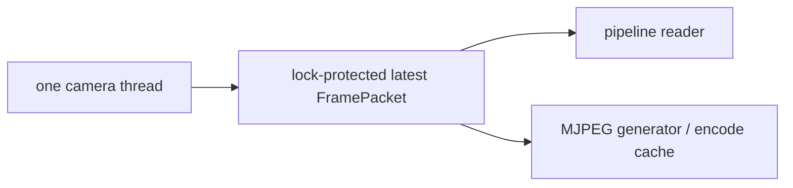
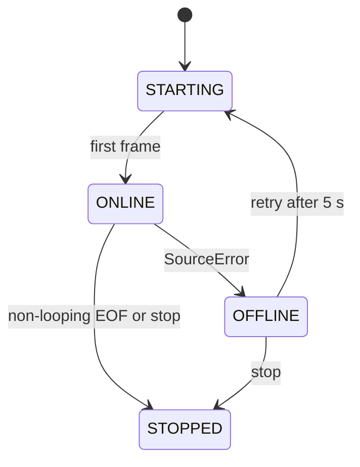

# Camera

Owner: Marc, Codex stream (@marcpedrin) — `feature/backend-camera`

## 1. Purpose & scope

The camera module makes prerecorded files behave like live CCTV: it decodes, paces, loops, retries, and exposes immutable latest frames.
It serves browser MJPEG/snapshots but does not detect riders; pipeline owns overlays and detection.

## 2. Owner & files

Owned paths are `backend/app/camera/`, `backend/app/api/cameras.py`, `backend/config/cameras.yaml`, and `backend/tests/camera/`.
The implementation is the Camera node in [Architecture](../ARCHITECTURE.md) and implements the frozen camera protocol.

## 3. Architecture

## 4. Public interface

`load_cameras(path) -> list[CameraConfig]` validates YAML, and `create_camera_manager(settings) -> CameraManagerProtocol` never raises.
`CameraManager` supplies `start`, `stop`, `latest_frame`, runtime/config access, overlay registration, and status listeners; all are thread-safe.

## 5. Configuration

`CAMERAS_CONFIG` names the YAML file; every entry has `camera_id`, `name`, `source`, `location`, `loop`, `enabled`, and `target_fps` (0 means native).
`APP_MODE=mock` permits synthetic fallback for a missing video; `STREAM_FPS`, `STREAM_WIDTH`, and `STREAM_JPEG_QUALITY` tune browser output.

## 6. Dependencies, models & licenses

OpenCV decodes video and encodes JPEG; PyYAML parses camera configuration; neither is a model dependency.
Input MP4s are local demo footage and are intentionally untracked.

## 7. Algorithms & design decisions

At each output, `desired_source_index = elapsed_monotonic_seconds × native_fps`; intermediate frames use `grab()` and only the selected frame is retrieved.
For a 25 fps clip at target 15 fps, outputs occur each 66.7 ms while source positions advance about 1.67 frames, so playback remains real-time; see ADRs 0004 and 0005.

## 8. Failure modes & fallbacks

In live mode missing/unreadable files become OFFLINE with a per-tile placeholder and retry every five seconds.
In mock mode only, missing files use a labelled 1280×720 synthetic source; a broken overlay is ignored and raw video stays available.

## 9. Performance

One camera thread only retains one frame, preventing unbounded queues; JPEG encoding runs in `asyncio.to_thread`.
The cache key is `(manager, camera, frame_index)`, so N tabs produce one encode per frame rather than N encodes.

## 10. Testing

Run `cd backend && python -m pytest tests/camera -q` and `python -m ruff check app/camera app/api/cameras.py`.
Tests cover YAML loading, synthetic fallback, read-only packet frames, JPEG output, and endpoint behavior as it is added.

## 11. Evaluation & verification results

On 2026-10-07, the focused camera/storage suite passed 10 tests on Windows/Python 3.12.
Performance measurements on the final four production clips remain an integration benchmark, not a claimed number from synthetic footage.

## 12. Troubleshooting / FAQ

An OFFLINE tile means the path is missing, unavailable, or OpenCV cannot decode it; restore the file and wait up to five seconds.
Choppy playback usually means a client/CPU JPEG bottleneck; lower `STREAM_WIDTH` or JPEG quality before changing source pacing.

## 13. Known limitations & future work

This source layer accepts files and synthetic video, not webcams or RTSP; both can be introduced behind the same source interface.
Browsers commonly limit HTTP connections per origin, so many MJPEG tiles/tabs can compete; WebRTC is a future option if scale requires it.

## 14. Changelog

- 2026-10-07 — feature/backend-camera — wall-clock video sources, retrying manager, cached MJPEG, and camera REST endpoints.
- 2026-10-07 — docs(camera): removed stub status and documented operational contracts.
