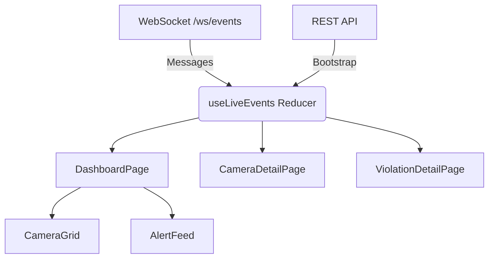

# Frontend

Owner: Harish (@harish-gh) - `feature/frontend-dashboard`

## 1. Purpose & scope

React dashboard serving as the user interface for the Helmet & Plate Detector. It renders a 2x2 live MJPEG grid, a live alert feed of violations, an evidence viewer, and dashboard statistics.
Does NOT own the wire contract (`src/types/contracts.ts` belongs to Marc).

## 2. Owner & files

- **Owner**: Harish (@harish-gh), branch: `feature/frontend-dashboard`
- **Directories**: 
  - `frontend/src/**` (excluding `types/contracts.ts`)
  - `frontend/index.html`
  - `frontend/vite.config.ts`, `vitest.config.ts`, `eslint.config.js`
- **Tests**: Vitest tests (`*.test.ts`, `*.test.tsx`) in `frontend/src/`.

## 3. Architecture

The frontend is a React 19 Single Page Application (SPA) built with Vite, Tailwind CSS v4, and shadcn/ui.
- **Routing**: `react-router-dom` handles navigation.
- **State**: Global state (WebSocket events) is managed via `useLiveEvents` Context Provider.
- **Data Flow**: On load, REST API fetches initial snapshot data. A WebSocket connection to `/ws/events` merges live updates into the state (violations, camera stats).

## 4. Public interface

Consumes:
- REST API via `src/services/api.ts` (base URL `/api`).
- WebSocket feed via `src/services/ws.ts` (`/ws/events`).
- MJPEG streams via ``.

Routes:
- `/` — Dashboard (Camera Grid, Stats, Alert Feed)
  
- `/violations` — Paginated list of all violations
  
- `/violations/:id` — Violation Detail (Evidence Viewer, Plate Status)
  
- `/cameras/:id` — Camera Detail (Large MJPEG stream, recent violations)
  
- `*` — 404 Not Found

## 5. Configuration

The application is served at `/` and infers the API URL from the current window location unless overridden.
- `VITE_API_URL`: Optional env variable to hardcode the API base URL (defaults to same-origin in production, `http://localhost:8000` in dev).

## 6. Dependencies, models & licenses

- **React 19** (MIT)
- **Vite** (MIT)
- **Tailwind CSS v4** (MIT)
- **shadcn/ui** (MIT components)
- **Recharts** (MIT)
- **Lucide React** (ISC)
- **Vitest / Testing Library** (MIT)

## 7. Algorithms & design decisions

- **Control Room Aesthetic**: Custom dark theme with `oklch` tokens and a monospace font (Geist Mono).
- **MJPEG Connection Cap**: Browsers limit HTTP/1.1 connections to ~6 per host. MJPEG streams never close. The `<CameraGrid>` caps streams at 4 to prevent starving REST/WS calls. (See `docs/adrs/mjpeg_connection_cap.md`).
- **Live State Merging**: Violations and camera metrics are merged in-place in `useLiveEvents.ts`. The UI automatically reacts to `violation_updated` (e.g. plate finalized). (See `docs/adrs/frontend_state.md`).

## 8. Failure modes & fallbacks

- **Backend Down**: Global `<ConnectionBanner>` polls `/api/health` every 10s. If it fails, a red banner appears.
  
- **WebSocket Disconnect**: Reconnects with exponential backoff + jitter (1s to 10s max). An amber banner warns the user.
  
- **Camera Offline**: The MJPEG image shows an offline overlay placeholder; retries automatically every 3s.
  
- **Component Crash**: Isolated by `<PageErrorBoundary>` which shows a local "Something went wrong" card instead of white-screening the app.

## 9. Performance

- **Bundle Size**: Initial JS payload is optimized via Vite splitting.
- **DOM Updates**: Live feed is limited to `MAX_RECENT=200` violations to prevent unbounded DOM growth in the alert sidebar and state manager.

## 10. Testing

- `npm run test` / `npm test` runs the Vitest suite.
- Tests cover `LiveEvents` state reducer, WS backoff logic, `formatPlate` heuristics, and UI components (`CameraCard`, `ViolationDetail`, `PlateBadge`).
- CI enforces `npm run typecheck` and `npm run lint`.

## 11. Evaluation & verification results

- Verified against backend `mock` mode. The dashboard correctly displays mock MJPEG streams, simulates violations, and handles WS reconnects seamlessly.

## 12. Troubleshooting / FAQ

- **Images not loading / streams stalled**: Ensure you are not viewing more than 4 cameras in separate tabs simultaneously due to the 6-connection browser limit.
- **WebSocket failing to connect**: Check if backend is running on `localhost:8000`.

## 13. Known limitations & future work

- Hard limit of 4 cameras per view; a dedicated RTSP/WebRTC proxy would be needed for a 16+ grid.
- No historical analytics beyond the current session in memory (requires a DB querying layer).

## 14. Changelog

- 2026-10-07 - Harish - Completed full UI implementation (pages, routing, WS integration, tests).
- 2026-10-07 - boilerplate - module doc created from the template (Marc).
