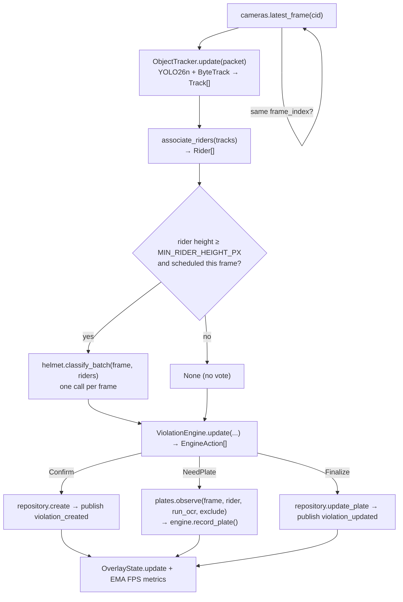

# Pipeline

Owner: Marc (@marcpedrin) - `feature/pipeline`

## 1. Purpose & scope

<!-- What this module does and explicitly does NOT do.
One paragraph; link the ARCHITECTURE.md diagram node it implements. -->

The pipeline turns camera frames into **exactly one violation per helmetless rider**: YOLO26n detects persons and
motorcycles, ByteTrack gives them stable ids, rider association groups persons onto bikes, the helmet classifier
(Prajwal) votes per frame, the **violation engine** confirms a violation only after a temporal rule (6 of the last
10 looks), the best evidence frame is kept, plates (Malik) are collected and voted, and the runner persists the result
and publishes `violation_created` / `violation_updated`. It implements the "Frame Processor → … → Evidence" nodes of
[ARCHITECTURE.md §2](../ARCHITECTURE.md#2-detection-pipeline).

It does **not** decode video or serve MJPEG (camera), run helmet/plate models (helmet, plates), store data
(storage) or serve HTTP (api). In mock mode `MockRunner` replaces the whole pipeline with fake data.

## 2. Owner & files

<!-- Owner name + GitHub handle, branch, and every file/dir owned (paths).
List tests and fixtures too. -->

Marc (@marcpedrin), branch `feature/pipeline` (Phase 3 work on `feature/integration`).

| File | Role |
|---|---|
| `backend/app/pipeline/detector.py` + `bytetrack.yaml` | `ObjectTracker`: YOLO26n + ByteTrack, one per camera |
| `backend/app/pipeline/association.py` | `associate_riders()`: persons → motorcycles |
| `backend/app/pipeline/violation_engine.py` | `ViolationEngine`: pure state machine, emits `EngineAction`s |
| `backend/app/pipeline/evidence.py` | evidence scoring + `EvidenceBundle` building |
| `backend/app/pipeline/overlay.py` | `OverlayState.draw()`: boxes + HUD on MJPEG frames |
| `backend/app/pipeline/runner.py` | `PipelineRunner`: threads, scheduling, I/O, metrics |
| `backend/app/pipeline/mock_runner.py` | `MockRunner` for `APP_MODE=mock` |
| `scripts/run_pipeline_offline.py` | offline tuning tool: video in → annotated MP4 + summary |
| `backend/tests/pipeline/`, `backend/tests/fixtures/pipeline/` | unit + runner tests, fixture frame |

## 3. Architecture

<!-- Internal structure: classes, threads, data flow. Prefer a Mermaid diagram.
Save screenshots/diagrams in docs/images/<module>/. -->

Per-frame loop (one thread per camera, paced at `PIPELINE_FPS`):



A separate timer thread publishes `camera_metrics` (2 Hz per camera) and `stats` (every 5 s).
The engine is **pure** (no I/O, injected clock): the runner executes every side effect, which keeps the lifecycle
unit-testable without models.

## 4. Public interface

<!-- Exact signatures callers rely on (copy from code), inputs/outputs, thread-safety.
Any change here needs a contracts/* PR. -->

```python
class ObjectTracker:                       # one per camera, single-thread use
    state: ModelState; device: str
    def __init__(self, settings: Settings, camera_id: str) -> None: ...   # never raises
    def update(self, packet: FramePacket) -> list[Track]: ...             # [] when not LOADED

def associate_riders(tracks: Sequence[Track], frame_w: int, frame_h: int) -> list[Rider]: ...

class ViolationEngine:                     # one per camera, single-thread use
    def __init__(self, settings: Settings, camera_id: str,
                 voter_factory: Callable[[], PlateVoterProtocol]) -> None: ...
    def update(self, camera_id: str, packet: FramePacket, riders: Sequence[Rider],
               helmet_results: Sequence[HelmetResult | None], now: float) -> list[EngineAction]: ...
    def record_plate(self, rider_id: int, obs: PlateObservation) -> None: ...
    def phase(self, rider_id: int) -> TrackPhase | None: ...
EngineAction = NeedPlate | Confirm | Finalize   # dataclasses

def evidence_score(image, bbox, helmet_conf) -> float: ...
def build_evidence(candidate: EvidenceCandidate, track_id: int) -> EvidenceBundle: ...

class OverlayState:                        # thread-safe
    def update(self, camera_id, riders: Sequence[OverlayRider], fps: float) -> None: ...
    def draw(self, camera_id: str, image: np.ndarray) -> np.ndarray: ...   # OverlayFn, never raises

class PipelineRunner:                      # start/stop/metrics from any thread
    def __init__(self, settings, cameras, helmet, plates, repository, publisher, stats_fn,
                 overlay: OverlayState, tracker_factory=None) -> None: ...
    detector_state: ModelState; def start(); def stop(); def metrics(camera_id) -> PipelineMetrics
```

Inputs: `FramePacket` (camera), `list[HelmetResult]` (helmet), `PlateObservation` / `PlateVoterProtocol`
(plates). Outputs: `ViolationEvent` → `repository.create`, `update_plate`; WS messages via `EventPublisherProtocol`;
the overlay registered with `cameras.set_overlay(overlay.draw)` in `container.py`.

## 5. Configuration

<!-- Every .env key this module reads: name, default, unit, effect, tuning advice. -->

| Key | Default | Unit | Effect / tuning |
|---|---|---|---|
| `DETECTOR_WEIGHTS` | `yolo26n.pt` | file | Ultralytics weights (auto-download) |
| `DETECTOR_IMGSZ` | `640` | px | Inference size; 512 on slow CPUs (−~35 % latency, loses small riders) |
| `DETECTOR_CONF` | `0.30` | 0-1 | Min box confidence; raise if pedestrians/bikes flicker in |
| `DEVICE` | `auto` | — | `auto` → `cuda:0` if available else `cpu`; FP16 only on CUDA |
| `PIPELINE_FPS` | `5` | Hz | Processing rate per camera (GPU 8, CPU 4 on the demo laptop) |
| `MIN_RIDER_HEIGHT_PX` | `80` | px | Riders smaller than this are not helmet-classified (no vote) |
| `VIOLATION_WINDOW` | `10` | observations | Sliding window of helmet looks per track |
| `VIOLATION_MIN_HITS` | `6` | count | NO_HELMET looks needed in the window to confirm (SUSPECTED at ⌈hits/2⌉) |
| `VIOLATION_MIN_CONF` | `0.50` | 0-1 | Mean NO_HELMET confidence needed to confirm |
| `VIOLATION_MAX_HELMET_HITS` | `2` | count | More HELMET looks than this in the window blocks confirmation |
| `PLATE_WINDOW_S` | `3.0` | s | Plate collection after confirmation before finalizing |
| `PLATE_MAX_OCR_PER_TRACK` | `8` | calls | OCR budget per track (detection continues after it) |
| `DEDUP_IOU` | `0.3` | 0-1 | ID-switch guard IoU |
| `DEDUP_WINDOW_S` | `5.0` | s | ID-switch guard time window |

## 6. Dependencies, models & licenses

<!-- Packages (with versions), model files, sources, licenses, download steps. -->

TBD

## 7. Algorithms & design decisions

<!-- How it works and WHY. Thresholds with rationale (mirror the # WHY: comments).
Link ADRs for non-trivial decisions. -->

TBD

## 8. Failure modes & fallbacks

<!-- What happens when weights/files/devices are missing or inputs are bad.
States reported to /api/health; never crash the app. -->

TBD

## 9. Performance

<!-- Measured latency/FPS on CPU and GPU (machine + numbers), memory, bottlenecks. -->

TBD

## 10. Testing

<!-- How to run the tests; what they cover; model tests (@pytest.mark.model) and fixtures. -->

TBD

## 11. Evaluation & verification results

<!-- Numbers on OUR footage (precision/recall, accuracy), dataset description, date, commit. -->

TBD

## 12. Troubleshooting / FAQ

<!-- Symptom -> cause -> fix entries learned during development. -->

TBD

## 13. Known limitations & future work

<!-- Honest list of what does not work and what you would do next. -->

TBD

## 14. Changelog

<!-- Date - PR - change. Newest first. Updated in every PR. -->

- 2026-10-07 - feature/pipeline - design (sections 1-5) written; stub marker removed (Marc).
- 2026-10-07 - boilerplate - module doc created from the template (Marc).
