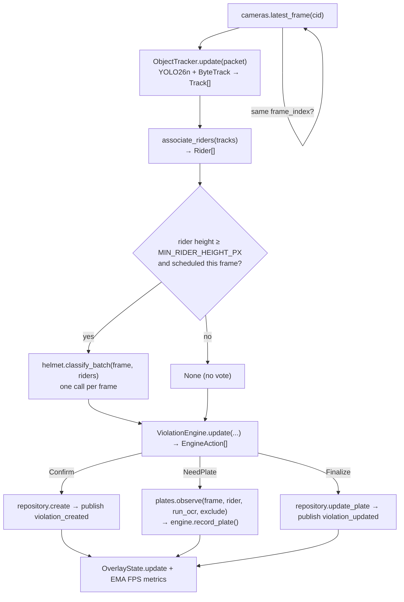
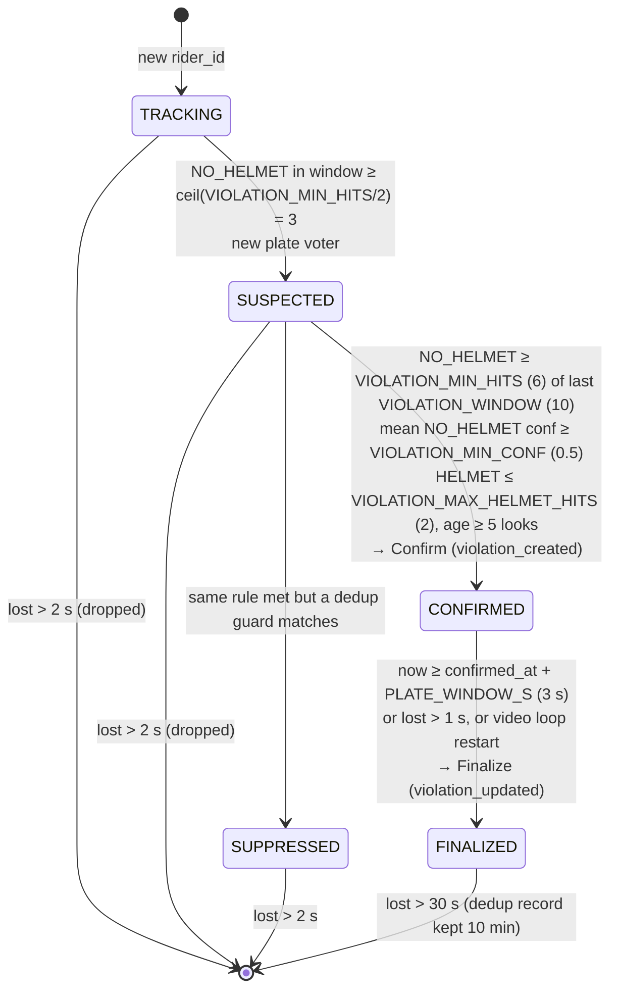

# Pipeline

Owner: Marc (@marcpedrin) - `feature/pipeline`

## 1. Purpose & scope

<!-- What this module does and explicitly does NOT do.
One paragraph; link the ARCHITECTURE.md diagram node it implements. -->

The pipeline turns camera frames into **exactly one violation per helmetless rider**: YOLO26n detects persons and
motorcycles, ByteTrack gives them stable ids, rider association groups persons onto bikes, the helmet classifier
(Prajwal) votes per frame, the **violation engine** confirms a violation only after a temporal rule (6 of the last
10 looks), the best evidence frame is kept, plates (Malik) are collected and voted, and the runner persists the result
and publishes `violation_created` / `violation_updated`. It implements the "Frame Processor → … → Evidence" nodes of
[ARCHITECTURE.md §2](../ARCHITECTURE.md#2-detection-pipeline).

It does **not** decode video or serve MJPEG (camera), run helmet/plate models (helmet, plates), store data
(storage) or serve HTTP (api). In mock mode `MockRunner` replaces the whole pipeline with fake data.

## 2. Owner & files

<!-- Owner name + GitHub handle, branch, and every file/dir owned (paths).
List tests and fixtures too. -->

Marc (@marcpedrin), branch `feature/pipeline` (Phase 3 work on `feature/integration`).

| File | Role |
|---|---|
| `backend/app/pipeline/detector.py` + `bytetrack.yaml` | `ObjectTracker`: YOLO26n + ByteTrack, one per camera |
| `backend/app/pipeline/association.py` | `associate_riders()`: persons → motorcycles |
| `backend/app/pipeline/violation_engine.py` | `ViolationEngine`: pure state machine, emits `EngineAction`s |
| `backend/app/pipeline/evidence.py` | evidence scoring + `EvidenceBundle` building |
| `backend/app/pipeline/overlay.py` | `OverlayState.draw()`: boxes + HUD on MJPEG frames |
| `backend/app/pipeline/runner.py` | `PipelineRunner`: threads, scheduling, I/O, metrics |
| `backend/app/pipeline/mock_runner.py` | `MockRunner` for `APP_MODE=mock` |
| `scripts/run_pipeline_offline.py` | offline tuning tool: video in → annotated MP4 + summary |
| `backend/tests/pipeline/`, `backend/tests/fixtures/pipeline/` | unit + runner tests, fixture frame |

## 3. Architecture

<!-- Internal structure: classes, threads, data flow. Prefer a Mermaid diagram.
Save screenshots/diagrams in docs/images/<module>/. -->

Per-frame loop (one thread per camera, paced at `PIPELINE_FPS`):



A separate timer thread publishes `camera_metrics` (2 Hz per camera) and `stats` (every 5 s).
The engine is **pure** (no I/O, injected clock): the runner executes every side effect, which keeps the lifecycle
unit-testable without models.

## 4. Public interface

<!-- Exact signatures callers rely on (copy from code), inputs/outputs, thread-safety.
Any change here needs a contracts/* PR. -->

```python
class ObjectTracker:                       # one per camera, single-thread use
    state: ModelState; device: str
    def __init__(self, settings: Settings, camera_id: str) -> None: ...   # never raises
    def update(self, packet: FramePacket) -> list[Track]: ...             # [] when not LOADED

def associate_riders(tracks: Sequence[Track], frame_w: int, frame_h: int) -> list[Rider]: ...

class ViolationEngine:                     # one per camera, single-thread use
    def __init__(self, settings: Settings, camera_id: str,
                 voter_factory: Callable[[], PlateVoterProtocol]) -> None: ...
    def update(self, camera_id: str, packet: FramePacket, riders: Sequence[Rider],
               helmet_results: Sequence[HelmetResult | None], now: float) -> list[EngineAction]: ...
    def record_plate(self, rider_id: int, obs: PlateObservation) -> None: ...
    def phase(self, rider_id: int) -> TrackPhase | None: ...
    def plate_text(self, rider_id: int) -> str | None: ...
EngineAction = NeedPlate | Confirm | Finalize   # dataclasses

def evidence_score(image, bbox, helmet_conf) -> float: ...
def offer(current: EvidenceCandidate | None, packet, bbox, helmet_conf) -> EvidenceCandidate | None: ...
def build_evidence(candidate: EvidenceCandidate, track_id: int) -> EvidenceBundle: ...

class OverlayState:                        # thread-safe
    def update(self, camera_id, riders: Sequence[OverlayRider], fps: float) -> None: ...
    def draw(self, camera_id: str, image: np.ndarray) -> np.ndarray: ...   # OverlayFn, never raises

class PipelineRunner:                      # start/stop/metrics from any thread
    def __init__(self, settings, cameras, helmet, plates, repository, publisher, stats_fn,
                 overlay=None, tracker_factory=None, clock=time.time) -> None: ...
    detector_state: ModelState; def start(); def stop(); def metrics(camera_id) -> PipelineMetrics
```

Inputs: `FramePacket` (camera), `list[HelmetResult]` (helmet), `PlateObservation` / `PlateVoterProtocol`
(plates). Outputs: `ViolationEvent` → `repository.create`, `update_plate`; WS messages via `EventPublisherProtocol`;
the overlay registered with `cameras.set_overlay(overlay.draw)` in `container.py`.

## 5. Configuration

<!-- Every .env key this module reads: name, default, unit, effect, tuning advice. -->

| Key | Default | Unit | Effect / tuning |
|---|---|---|---|
| `DETECTOR_WEIGHTS` | `yolo26n.pt` | file | Ultralytics weights (auto-download) |
| `DETECTOR_IMGSZ` | `640` | px | Inference size; 512 on slow CPUs (−~35 % latency, loses small riders) |
| `DETECTOR_CONF` | `0.30` | 0-1 | Min box confidence; raise if pedestrians/bikes flicker in |
| `DEVICE` | `auto` | — | `auto` → `cuda:0` if available else `cpu`; FP16 only on CUDA |
| `PIPELINE_FPS` | `5` | Hz | Processing rate per camera (GPU 8, CPU 4 on the demo laptop) |
| `MIN_RIDER_HEIGHT_PX` | `80` | px | Riders smaller than this are not helmet-classified (no vote) |
| `VIOLATION_WINDOW` | `10` | observations | Sliding window of helmet looks per track |
| `VIOLATION_MIN_HITS` | `6` | count | NO_HELMET looks needed in the window to confirm (SUSPECTED at ⌈hits/2⌉) |
| `VIOLATION_MIN_CONF` | `0.50` | 0-1 | Mean NO_HELMET confidence needed to confirm |
| `VIOLATION_MAX_HELMET_HITS` | `2` | count | More HELMET looks than this in the window blocks confirmation |
| `PLATE_WINDOW_S` | `3.0` | s | Plate collection after confirmation before finalizing |
| `PLATE_MAX_OCR_PER_TRACK` | `8` | calls | OCR budget per track (detection continues after it) |
| `DEDUP_IOU` | `0.3` | 0-1 | ID-switch guard IoU |
| `DEDUP_WINDOW_S` | `5.0` | s | ID-switch guard time window |

## 6. Dependencies, models & licenses

<!-- Packages (with versions), model files, sources, licenses, download steps. -->

| Dependency | Version (tested) | License | Notes |
|---|---|---|---|
| ultralytics | 8.4.174 | AGPL-3.0 | YOLO26n + built-in ByteTrack; imported lazily in `ObjectTracker.__init__` |
| torch | 2.14.1 (+cpu) | BSD-3 | pulled in by ultralytics; GPU users install the CUDA wheel first (see `requirements-ml.txt`) |
| opencv-python | 5.0.0 | Apache-2.0 | evidence crops, Laplacian focus measure, overlay drawing |
| `yolo26n.pt` | auto-download | AGPL-3.0 | saved to `backend/models/yolo26n.pt` (git-ignored) by `resolve_weights()` on first load |

Download ahead of the demo: `python scripts/download_models.py`. Summary of all models: [MODELS.md](../MODELS.md).

## 7. Algorithms & design decisions

<!-- How it works and WHY. Thresholds with rationale (mirror the # WHY: comments).
Link ADRs for non-trivial decisions. -->

**Detection + tracking** ([ADR 0004](../adr/0004-marc-bytetrack-tracker.md)). `model.track(classes=[0, 3])` with
`pipeline/bytetrack.yaml` (`track_high_thresh 0.4`, `new_track_thresh 0.45`, `track_buffer 15` ≈ 3 s at 5 FPS).
`persist=False` on the first frame of each new `loop_index` resets ids when a prerecorded video restarts.

**Rider association** (`association.py`). For every motorcycle M:

```
        ┌──── expand(M, fx=0.2, fy_top=1.2, fy_bottom=0.1) ────┐
        │                ┌──────┐   person P is a candidate if: │
        │                │  P   │   1. ioa(P, search) ≥ 0.5     │
        │                │      │   2. M.y1 ≤ P.y2 ≤ M.y2+0.1·M.h│
        │           ┌────┼──────┼─┐ 3. P.cy < M.cy + 0.25·M.h   │
        │           │  M │      │ │                             │
        │           └────┴──────┴─┘                             │
        └───────────────────────────────────────────────────────┘
```

Each person goes to the candidate bike with the highest IoA (greedy, one bike per person), which handles
several bikes per frame and pillions (2-3 persons). Unassigned persons are pedestrians. `Rider.bbox` =
union(M, persons), or `expand(M, 0.05, 0.8, 0)` when nobody was assigned (the helmet model still gets the head
region). `rider_id = M.track_id`.

**Helmet scheduling** (runner). Riders shorter than `MIN_RIDER_HEIGHT_PX` are not classified (result `None`, no
vote, overlay shows UNKNOWN). One `classify_batch` per processed frame. On CPU with more than 4 eligible riders,
each track is classified on alternate frames (`(processed + rider_id) % 2`).

**Violation lifecycle** ([ADR 0005](../adr/0005-marc-confirmation-rule.md)):



The window holds every *classified* look (HELMET, NO_HELMET or UNKNOWN); `None` (not classified this frame)
keeps the track alive without voting. Plate collection runs while SUSPECTED and CONFIRMED: `NeedPlate(run_ocr=
voter.ocr_count < PLATE_MAX_OCR_PER_TRACK)`; after the OCR budget the detector still runs so `best_crop` keeps
improving. Plate boxes already claimed by another rider in the same frame are passed as `exclude`.
Finalize uses `voter.result()`; a voter that never received anything maps to `NOT_DETECTED`.

**Dedup guards** ([ADR 0006](../adr/0006-marc-dedup-and-loop-guard.md)), checked at confirmation; a match →
SUPPRESSED, nothing emitted:

| Guard | Rule | Example |
|---|---|---|
| (a) per track | a record with the same `track_id` and `loop_index` exists | track #37 finalized, GC'd after 30 s, seen again → no 2nd violation |
| (b) ID switch | another violation on this camera last seen ≤ `DEDUP_WINDOW_S` (5 s) ago with IoU(last bbox, bbox) ≥ `DEDUP_IOU` (0.3) | #37 occluded by a bus, re-appears as #52 two seconds later at IoU 0.6 → suppressed |
| (c) video loop | a violation from an earlier `loop_index` with \|Δ video_pos_ms\| ≤ 1500 and IoU(confirm bbox) ≥ 0.3 | clip restarts; the same rider is confirmed at 12.4 s again → suppressed |

**Evidence scoring** ([ADR 0007](../adr/0007-marc-evidence-scoring.md)). For each NO_HELMET look while SUSPECTED or
CONFIRMED: `score = conf × min(1, h/250) × min(1, lapvar/300) × (0.5 if the box is within 4 px of the border)`.
Worked example: conf 0.9, rider 200 px tall, Laplacian variance 450, not touching → 0.9 × 0.8 × 1.0 × 1 = **0.72**;
a later frame with conf 0.95, 260 px but motion-blurred (lapvar 120) → 0.95 × 1 × 0.4 = **0.38**, so the first frame
is kept. Only the winning frame is copied (one frame per suspected track). At confirmation the bundle is the
annotated full frame (red box + `NO HELMET 0.93 | #37`) and `crop(expand(bbox, 0.1))`; the plate crop arrives
with `update_plate`.

**Threading** ([ADR 0008](../adr/0008-marc-threading-model.md)):

| Thread | Calls | Shared state / lock |
|---|---|---|
| `camera-<cid>` (camera module) | decode, `latest` buffer | camera worker lock |
| `pipeline-<cid>` | `latest_frame`, tracker, helmet, engine, plates, repository, `hub.publish` | tracker + engine are thread-confined; `_metrics` under runner lock; overlay under its lock |
| `pipeline-broadcast` | `metrics()`, `overlay.track_overlays()`, `stats_fn()`, `hub.publish` | same locks, read-only |
| asyncio loop | MJPEG encode (`to_thread`), `overlay.draw`, WS fan-out | overlay lock (snapshot), hub queues |

## 8. Failure modes & fallbacks

<!-- What happens when weights/files/devices are missing or inputs are bad.
States reported to /api/health; never crash the app. -->

| Failure | Behaviour | Visible as |
|---|---|---|
| ultralytics not installed | `ObjectTracker.state = NOT_LOADED`, `update()` returns `[]` | health `detector: NOT_LOADED`, `degraded`; raw feeds still stream |
| weights download/load error | `state = ERROR`, error logged | health `detector: ERROR` |
| detector exception on a frame | iteration skipped, error counted; ≥ 3 in a row zero that camera's metrics | `processing_fps 0` for the camera; thread keeps running |
| helmet `NOT_LOADED` (mock fallback) | every rider UNKNOWN, no violations | health `helmet: NOT_LOADED`; amber boxes |
| helmet exception / wrong result count | all riders `None` this frame (no vote), error logged | nothing; votes resume next frame |
| plate service `NOT_LOADED` | observations empty → plate `NOT_DETECTED` at finalize | `violation_updated` with `NOT_DETECTED` |
| `repository.create` fails | logged; the later `Finalize` fails with KeyError (logged) | no violation for that rider |
| slow frame (> 1/`PIPELINE_FPS`) | next iteration starts immediately on the newest frame (stale frames are skipped, never queued) | lower `processing_fps` |
| camera OFFLINE / no new frame | iteration is a no-op (same `frame_index`) | camera_status OFFLINE |
| video loop restart | tracker reset, confirmed tracks finalized, loop guard blocks repeats | — |

## 9. Performance

<!-- Measured latency/FPS on CPU and GPU (machine + numbers), memory, bottlenecks. -->

Measured 2026-10-07 on the dev laptop: Intel i5-8350U (4C/8T, 1.7 GHz), 16 GB RAM, **no GPU**, torch 2.14 CPU,
YOLO26n tracking on a 1280×720 frame (median of 10). The machine was memory-constrained during these runs
(commit charge ~19/24 GB from other apps), so treat the numbers as a lower bound.

| imgsz | 1 camera | 4 cameras concurrently (per camera) | total inferences/s |
|---|---|---|---|
| 640 | 260 ms → 3.8 FPS | 1.2 FPS | ~4.7 |
| 512 | 166 ms → 6.0 FPS | 1.9 FPS | ~7.6 |
| 416 | 98 ms → 10.2 FPS | 1.7 FPS | ~6.9 |

Live mode, 4 synthetic cameras, `DETECTOR_IMGSZ=416 PIPELINE_FPS=2`: all four cameras held **2.0-2.1 FPS**.
Bottleneck: the CPU saturates at ~7 detector inferences/s in total, so ≥ 4 FPS × 4 cameras (16/s + helmet
inference) is **not reachable on this CPU**. Recommended configs:

| Hardware | Config |
|---|---|
| NVIDIA GPU (≥ 4 GB) | `PIPELINE_FPS=8`, `DETECTOR_IMGSZ=640`, 4 cameras |
| This class of CPU | `PIPELINE_FPS=3`, `DETECTOR_IMGSZ=512`, **2-3 cameras** (disable one in `cameras.yaml`), `STREAM_FPS=10` |

GPU numbers are not measured yet (no GPU on the dev machine). Next CPU lever: OpenVINO export (future work, §13).

## 10. Testing

<!-- How to run the tests; what they cover; model tests (@pytest.mark.model) and fixtures. -->

```bash
cd backend
pytest tests/pipeline tests/api -q        # unit + runner + API (no ML needed)
pytest -m model -q                        # YOLO26n on fixtures/pipeline/street.jpg (needs ultralytics)
python ../scripts/run_pipeline_offline.py --video ../videos/camera_01.mp4 --out ../out.mp4 --max-seconds 60
```

| File | Covers |
|---|---|
| `test_association.py` | 2 bikes + 3 persons + pedestrian, pillion, highest-IoA tie-break, bike without person, clipping |
| `test_engine.py` | 6-of-10 confirm once; 5 hits; ≥3 HELMET; low conf; no 2nd confirm; ID-switch and loop suppression; finalize READ/UNREADABLE/NOT_DETECTED; early finalize when lost; drop; OCR budget; `None` looks |
| `test_evidence.py` | sharper/larger wins, border penalty, copy-on-win, annotated bundle |
| `test_smoke.py` | geometry helpers; overlay draws and never raises on odd image sizes |
| `test_runner.py` | real camera threads (synthetic) + fake tracker + scripted helmet → exactly one `violation_created` + one `violation_updated`; helmet exceptions don't kill the thread |
| `test_model.py` (`-m model`) | YOLO26n finds ≥ 1 person on `fixtures/pipeline/street.jpg` (Ultralytics sample image, AGPL), ids persist |

## 11. Evaluation & verification results

<!-- Numbers on OUR footage (precision/recall, accuracy), dataset description, date, commit. -->

As of 2026-10-07 (commit on `feature/pipeline`) **no demo clips exist in `videos/`** and the real helmet/plate
modules have not landed, so the per-clip tuning table below has no rows yet. Verified so far: all unit/runner
tests, YOLO26n on the street fixture, live mode on 4 synthetic cameras (no crash, health `degraded` as expected),
and `run_pipeline_offline.py --helmet scripted` on a 10 s test clip (24 frames processed, 0 riders: the fixture
has people but no motorcycles).

| Clip | DETECTOR_CONF | MIN_RIDER_HEIGHT_PX | HELMET_CONF | VIOLATION_MIN_HITS | PLATE_WINDOW_S | False violations | Missed | Plates READ |
|---|---|---|---|---|---|---|---|---|

Rows are added in Phase 3 (`feature/integration`) from `run_pipeline_offline.py` output on each demo clip.

## 12. Troubleshooting / FAQ

<!-- Symptom -> cause -> fix entries learned during development. -->

| Symptom | Cause | Fix |
|---|---|---|
| Boxes flicker / ids change | detections near `track_high_thresh`, low FPS | raise `DETECTOR_CONF` to 0.35-0.4; keep `PIPELINE_FPS` ≥ 4; `track_buffer` in `bytetrack.yaml` |
| Duplicate violations for one rider | ID switch outside 5 s / IoU < 0.3, or loop position drift > 1.5 s | raise `DEDUP_WINDOW_S`, lower `DEDUP_IOU` to 0.2; check the clip loops cleanly |
| No violations at all | helmet `NOT_LOADED` (all UNKNOWN), riders < `MIN_RIDER_HEIGHT_PX`, or < 6 looks before the rider leaves | check `/api/health`; lower `MIN_RIDER_HEIGHT_PX`; lower `VIOLATION_MIN_HITS`/raise `PIPELINE_FPS` |
| FPS < 3 | CPU saturated (see §9) | `DETECTOR_IMGSZ=512`, fewer cameras, `STREAM_FPS=10`, use a GPU |
| `half is deprecated` warning | old code passing `half=False` | fixed: `half` is only passed on CUDA |
| `not enough memory` from torch | machine commit charge exhausted | close other apps; 4 trackers need ~1.5 GB |

## 13. Known limitations & future work

<!-- Honest list of what does not work and what you would do next. -->

- 4 cameras at ≥ 4 FPS needs a GPU; on the dev CPU only 2-3 cameras at ~3 FPS are realistic. Next: OpenVINO
  export of YOLO26n for Intel CPUs, and capping torch threads per tracker to reduce oversubscription (measure first).
- Per-clip tuning (§11) and the demo thresholds wait for the real clips and the helmet/plate modules (Phase 3).
- Association is pure geometry; heavily overlapping bikes in dense traffic can swap pillions. A re-ID or
  person-track history vote would fix it.
- The loop guard assumes the same rider is confirmed at a similar file position each loop; a different
  confirmation frame > 1.5 s apart would slip through (raise the tolerance if seen).
- Dedup records live in memory: a backend restart forgets them (the same looping clip can then re-fire once).

## 14. Changelog

<!-- Date - PR - change. Newest first. Updated in every PR. -->

- 2026-10-07 - #2 feature/pipeline - ObjectTracker (YOLO26n + ByteTrack), association, violation engine with dedup
  guards, evidence scoring, overlay, PipelineRunner, live wiring, offline tuning script, CPU benchmarks (Marc).
- 2026-10-07 - #2 feature/pipeline - design (sections 1-5) written; stub marker removed (Marc).
- 2026-10-07 - boilerplate - module doc created from the template (Marc).
