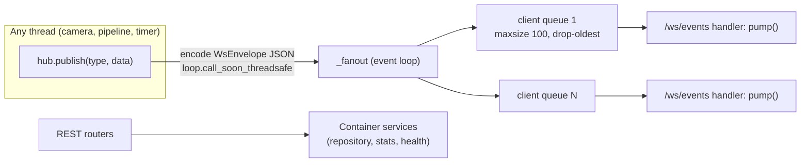

# Realtime & API

Owner: Marc (@marcpedrin) - `feature/pipeline`

## 1. Purpose & scope

<!-- What this module does and explicitly does NOT do.
One paragraph; link the ARCHITECTURE.md diagram node it implements. -->

EventHub (thread -> asyncio fan-out), `/ws/events`, and the REST endpoints for health, violations and stats.
Does NOT implement camera endpoints (camera stream) or business logic (container services).

## 2. Owner & files

<!-- Owner name + GitHub handle, branch, and every file/dir owned (paths).
List tests and fixtures too. -->

`backend/app/realtime/hub.py`, `backend/app/api/{__init__,health,violations,stats,ws}.py`, `backend/app/main.py`, `backend/app/container.py`
Tests: `backend/tests/api/`.

## 3. Architecture

<!-- Internal structure: classes, threads, data flow. Prefer a Mermaid diagram.
Save screenshots/diagrams in docs/images/<module>/. -->



`main.create_app()` builds the `Container` in the lifespan, binds the hub to the running loop, starts services and
mounts `/evidence` plus the built SPA (`frontend/dist`, with index.html fallback for deep links).

## 4. Public interface

<!-- Exact signatures callers rely on (copy from code), inputs/outputs, thread-safety.
Any change here needs a contracts/* PR. -->

```python
EventHub.publish(type: str, data: dict) -> None   # any thread, never blocks
await EventHub.connect(ws) -> asyncio.Queue[str]; await EventHub.disconnect(ws)
```
REST + WS tables: [docs/CONTRACTS.md](../CONTRACTS.md).

## 5. Configuration

<!-- Every .env key this module reads: name, default, unit, effect, tuning advice. -->

| Key | Default | Effect |
|---|---|---|
| `CORS_ORIGINS` | `http://localhost:5173` | Allowed browser origins (comma-separated) |
| `EVIDENCE_DIR` | `evidence` | Mounted read-only at `/evidence` |
| `EVIDENCE_RETENTION_DAYS` | `7` | `repository.purge_older_than()` at startup |
| `APP_MODE` | `mock` | Reported in `hello` and `/api/health` |

Hub constants (code, not env): per-client queue `100` messages, `camera_metrics` ≤ 2 Hz/camera, `stats` every 5 s.

## 6. Dependencies, models & licenses

<!-- Packages (with versions), model files, sources, licenses, download steps. -->

TBD

## 7. Algorithms & design decisions

<!-- How it works and WHY. Thresholds with rationale (mirror the # WHY: comments).
Link ADRs for non-trivial decisions. -->

TBD

## 8. Failure modes & fallbacks

<!-- What happens when weights/files/devices are missing or inputs are bad.
States reported to /api/health; never crash the app. -->

TBD

## 9. Performance

<!-- Measured latency/FPS on CPU and GPU (machine + numbers), memory, bottlenecks. -->

TBD

## 10. Testing

<!-- How to run the tests; what they cover; model tests (@pytest.mark.model) and fixtures. -->

TBD

## 11. Evaluation & verification results

<!-- Numbers on OUR footage (precision/recall, accuracy), dataset description, date, commit. -->

TBD

## 12. Troubleshooting / FAQ

<!-- Symptom -> cause -> fix entries learned during development. -->

TBD

## 13. Known limitations & future work

<!-- Honest list of what does not work and what you would do next. -->

TBD

## 14. Changelog

<!-- Date - PR - change. Newest first. Updated in every PR. -->

- 2026-10-07 - feature/pipeline - design (sections 1-5) written; stub marker removed (Marc).
- 2026-10-07 - boilerplate - module doc created from the template (Marc).
