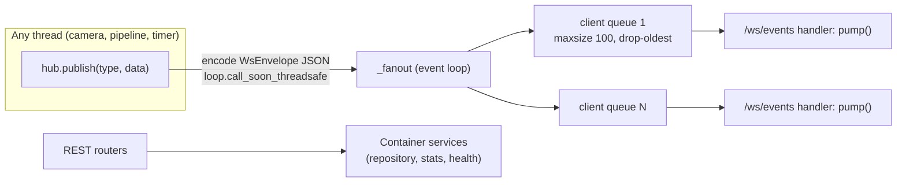

# Realtime & API

Owner: Marc (@marcpedrin) - `feature/pipeline`

## 1. Purpose & scope

<!-- What this module does and explicitly does NOT do.
One paragraph; link the ARCHITECTURE.md diagram node it implements. -->

EventHub (thread -> asyncio fan-out), `/ws/events`, and the REST endpoints for health, violations and stats.
Does NOT implement camera endpoints (camera stream) or business logic (container services).

## 2. Owner & files

<!-- Owner name + GitHub handle, branch, and every file/dir owned (paths).
List tests and fixtures too. -->

`backend/app/realtime/hub.py`, `backend/app/api/{__init__,health,violations,stats,ws}.py`, `backend/app/main.py`, `backend/app/container.py`
Tests: `backend/tests/api/`.

## 3. Architecture

<!-- Internal structure: classes, threads, data flow. Prefer a Mermaid diagram.
Save screenshots/diagrams in docs/images/<module>/. -->



`main.create_app()` builds the `Container` in the lifespan, binds the hub to the running loop, starts services and
mounts `/evidence` plus the built SPA (`frontend/dist`, with index.html fallback for deep links).

## 4. Public interface

<!-- Exact signatures callers rely on (copy from code), inputs/outputs, thread-safety.
Any change here needs a contracts/* PR. -->

```python
EventHub.publish(type: str, data: dict) -> None   # any thread, never blocks
await EventHub.connect(ws) -> asyncio.Queue[str]; await EventHub.disconnect(ws)
```
REST + WS tables: [docs/CONTRACTS.md](../CONTRACTS.md).

## 5. Configuration

<!-- Every .env key this module reads: name, default, unit, effect, tuning advice. -->

| Key | Default | Effect |
|---|---|---|
| `CORS_ORIGINS` | `http://localhost:5173` | Allowed browser origins (comma-separated) |
| `EVIDENCE_DIR` | `evidence` | Mounted read-only at `/evidence` |
| `EVIDENCE_RETENTION_DAYS` | `7` | `repository.purge_older_than()` at startup |
| `APP_MODE` | `mock` | Reported in `hello` and `/api/health` |

Hub constants (code, not env): per-client queue `100` messages, `camera_metrics` ≤ 2 Hz/camera, `stats` every 5 s.

## 6. Dependencies, models & licenses

<!-- Packages (with versions), model files, sources, licenses, download steps. -->

FastAPI 0.142 / Starlette 1.7 (MIT/BSD), uvicorn[standard] 0.54 with `websockets` 17 (BSD), pydantic 2.13 (MIT).
No models. Frontend served from `frontend/dist` (built by `npm run build`).

## 7. Algorithms & design decisions

<!-- How it works and WHY. Thresholds with rationale (mirror the # WHY: comments).
Link ADRs for non-trivial decisions. -->

**EventHub** (`realtime/hub.py`, [ADR 0002](../adr/0002-marc-mjpeg-plus-single-websocket.md)): `publish()` may be
called from any thread. It serialises the `WsEnvelope` in the caller's thread, then hands the string to the event
loop with `loop.call_soon_threadsafe(_fanout, text)`; `_fanout` puts it on every client's `asyncio.Queue(maxsize=100)`.
When a queue is full the **oldest** message is dropped: live dashboards want fresh state, and a slow tab must never
block pipeline threads. Each `/ws/events` handler runs two tasks: `pump` (queue → socket) and `drain` (reads to
detect disconnects); the first to finish cancels the other and the client is unregistered.

**Rates**: `camera_metrics` 2 Hz per camera, `stats` every 5 s (pipeline-broadcast thread or MockRunner),
`camera_status` on connect + on every camera state/error change, `violation_*` as they happen.

**Reconnect semantics**: the server keeps no per-client state. On (re)connect a client receives `hello` and one
`camera_status` per camera, then live messages; anything missed while disconnected must be re-read via
`GET /api/violations` (the frontend does this on reconnect). Client backoff: 1 s → 2 s → 4 s → 8 s → 10 s cap.

**REST endpoints (as built)**:

| Method + path | Response | Errors |
|---|---|---|
| `GET /api/health` | `HealthOut` | — |
| `GET /api/stats` | `StatsOut` | — |
| `GET /api/violations?camera_id&limit=50&offset=0` | `ViolationPage`, newest first | 422 if `limit` ∉ [1, 200] or `offset` < 0 |
| `GET /api/violations/{id}` | `ViolationOut` | 404 `{"detail": "violation not found"}` |
| `GET /api/cameras[/{id}]`, `/stream.mjpg`, `/snapshot.jpg` | camera module | 404 unknown camera, 503 no frame yet |
| `GET /evidence/...` | JPEG | 404 |
| `GET /<anything else>` | built SPA; extension-less unknown paths → `index.html` | 404 for missing assets and `/api/*` |

**Real payloads** (captured 2026-10-07 from an in-process mock run):

```json
{"type": "hello", "ts": "2026-10-07T07:21:08.804156Z", "data": {"mode": "mock", "version": "0.1.0", "cameras": ["CAM_01", "CAM_02", "CAM_03", "CAM_04"]}}
{"type": "camera_status", "ts": "2026-10-07T07:21:08.804156Z", "data": {"camera_id": "CAM_01", "name": "MG Road Junction", "location": "MG Road", "state": "ONLINE", "source_fps": 15.0, "processing_fps": 0.0, "frame_index": 0, "riders_in_view": 0, "stream_url": "/api/cameras/CAM_01/stream.mjpg", "snapshot_url": "/api/cameras/CAM_01/snapshot.jpg", "last_error": "source not found or unreadable: videos/camera_01.mp4; using synthetic"}}
{"type": "camera_metrics", "ts": "2026-10-07T07:21:08.891799Z", "data": {"camera_id": "CAM_01", "processing_fps": 4.83, "riders_in_view": 1, "tracks": [{"track_id": 2, "bbox": [302, 224, 454, 496], "helmet": "UNKNOWN"}]}}
{"type": "violation_created", "ts": "2026-10-07T07:21:09.526066Z", "data": {"id": "8cdf7f76b8244b998aaf689264354710", "camera_id": "CAM_02", "track_id": 7, "violation": "NO_HELMET", "plate": null, "plate_status": "PENDING", "plate_confidence": null, "helmet_confidence": 0.88, "timestamp": "2026-10-07T07:21:09.520070Z", "frame_index": 10, "rider_bbox": [325, 224, 477, 496], "evidence": {"full_frame_url": "/evidence/CAM_02/8cdf7f76b8244b998aaf689264354710/full_frame.jpg", "rider_crop_url": "/evidence/CAM_02/8cdf7f76b8244b998aaf689264354710/rider_crop.jpg", "plate_crop_url": null}}}
{"type": "violation_updated", "ts": "2026-10-07T07:21:10.056969Z", "data": {"id": "8cdf7f76b8244b998aaf689264354710", "camera_id": "CAM_02", "track_id": 7, "violation": "NO_HELMET", "plate": "KA01AB1234", "plate_status": "READ", "plate_confidence": 0.932, "helmet_confidence": 0.88, "timestamp": "2026-10-07T07:21:09.520070Z", "frame_index": 10, "rider_bbox": [325, 224, 477, 496], "evidence": {"full_frame_url": "/evidence/CAM_02/8cdf7f76b8244b998aaf689264354710/full_frame.jpg", "rider_crop_url": "/evidence/CAM_02/8cdf7f76b8244b998aaf689264354710/rider_crop.jpg", "plate_crop_url": "/evidence/CAM_02/8cdf7f76b8244b998aaf689264354710/plate_crop.jpg"}}}
{"type": "stats", "ts": "2026-10-07T07:21:09.853427Z", "data": {"total_violations": 4, "violations_by_camera": {"CAM_01": 1, "CAM_02": 1, "CAM_03": 1, "CAM_04": 1}, "plates_read": 0, "plates_unreadable": 0, "riders_in_view": 6, "cameras_online": 4, "cameras_total": 4, "uptime_s": 1.1}}
```

`GET /api/health` (live, before the helmet/plate modules landed):
`{"status": "degraded", "mode": "live", "models": {"detector": "LOADED", "helmet": "NOT_LOADED", "plate_detector": "NOT_LOADED", "ocr": "NOT_LOADED"}, "version": "0.1.0"}`

## 8. Failure modes & fallbacks

<!-- What happens when weights/files/devices are missing or inputs are bad.
States reported to /api/health; never crash the app. -->

| Failure | Behaviour |
|---|---|
| WS client disconnects / tab sleeps | handler unregisters the queue; publishers are unaffected |
| Slow WS client | its queue drops oldest messages beyond 100; other clients unaffected |
| `publish` before the loop is bound or during shutdown | silently ignored (never raises into pipeline threads) |
| Repository purge fails at startup | logged, startup continues |
| Any model not LOADED in live mode | `/api/health` → `status: degraded`, per-model states |
| Camera OFFLINE | `/api/health` → `degraded`; `camera_status` broadcast |
| Unknown violation id / bad paging | 404 / 422 (FastAPI validation) |

## 9. Performance

<!-- Measured latency/FPS on CPU and GPU (machine + numbers), memory, bottlenecks. -->

The hub costs one JSON serialisation per message (in the publishing thread) plus one `put_nowait` per client.
At 4 cameras the steady load is ~8 `camera_metrics`/s + 0.2 `stats`/s, a few KB/s per client. In tests a
message published from a plain thread reaches a TestClient WebSocket within one event-loop tick. REST handlers are
in-memory reads (SQLite once the storage stream lands). MJPEG (camera module) dominates bandwidth: ~1-2 MB/s per
camera at 960 px / q70 / 15 FPS.

## 10. Testing

<!-- How to run the tests; what they cover; model tests (@pytest.mark.model) and fixtures. -->

`cd backend && pytest tests/api -q`.
`test_smoke.py`: health mock mode, 4 cameras, snapshot JPEG, violations after mock emits, stats, WS `hello` then
4×`camera_status`, publish from a plain thread reaches a client, `violation_created` over WS.
`test_api.py`: pagination + newest-first order + camera filter, 422/404, stats counts, live-mode health
`degraded` with model states, SPA fallback (deep links → index.html; missing assets and `/api/*` stay 404).
End to end: `python scripts/smoke_test.py` against a running backend (mock or live).

## 11. Evaluation & verification results

<!-- Numbers on OUR footage (precision/recall, accuracy), dataset description, date, commit. -->

2026-10-07, `feature/pipeline`: 65 non-model tests pass. `smoke_test.py` passes in mock mode (violation within
~5 s) and in live mode on 4 synthetic cameras (detector LOADED, health `degraded`, violation check skipped because
helmet is NOT_LOADED). Deep link `/violations/abc` returns the SPA (200) when `frontend/dist` exists.

## 12. Troubleshooting / FAQ

<!-- Symptom -> cause -> fix entries learned during development. -->

| Symptom | Cause | Fix |
|---|---|---|
| Dashboard shows `ws: closed` | backend down, or wrong `VITE_API_BASE` | start backend; check `frontend/.env` |
| Messages arrive in bursts | event loop blocked by sync work | keep heavy work in threads (`asyncio.to_thread`) |
| Refreshing `/violations/x` gives 404 | frontend not built / not served by FastAPI | `npm run build`; restart backend |
| Browser stalls with 4 streams + API | HTTP/1.1 limit of ~6 connections per origin | one dashboard tab per browser |

## 13. Known limitations & future work

<!-- Honest list of what does not work and what you would do next. -->

- No authentication: local demo only (bind to 127.0.0.1).
- No replay of missed WS messages; clients refetch REST after reconnect.
- `stats` is computed from repository counts on every tick; fine for SQLite at demo scale.

## 14. Changelog

<!-- Date - PR - change. Newest first. Updated in every PR. -->

- 2026-10-07 - #2 feature/pipeline - live wiring, startup purge, SPA deep-link fallback, captured payloads (Marc).
- 2026-10-07 - #2 feature/pipeline - design (sections 1-5) written; stub marker removed (Marc).
- 2026-10-07 - boilerplate - module doc created from the template (Marc).
