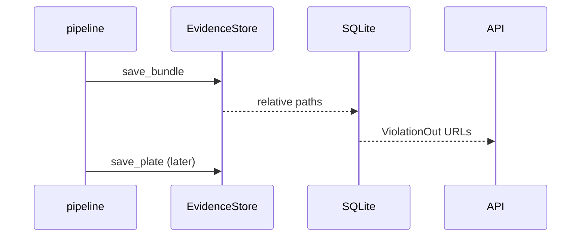

# Storage

Owner: Marc, Codex stream (@marcpedrin) — `feature/backend-camera`

## 1. Purpose & scope

Storage persists confirmed violations in local SQLite and atomically stores their JPEG evidence.
It does not decide whether a rider violated a rule; that is pipeline responsibility.

## 2. Owner & files

Owned paths are `backend/app/storage/`, `backend/tests/storage/`, and this module document.
The factory returns SQLite first and an in-memory repository only if initialization fails.

## 3. Architecture

Rows record ID, camera/track, violation, helmet/plate values, timestamp/frame/position, JSON rider box, relative JPEG paths, and creation time.

## 4. Public interface

`create_repository(settings) -> ViolationRepositoryProtocol` provides `create`, `update_plate`, `get`, `list`, `counts`, and `purge_older_than`.
`EvidenceStore.save_bundle(id, timestamp, bundle)` returns portable relative paths and `url_for(relative)` returns `/evidence/...`.

## 5. Configuration

`DB_PATH` points at SQLite; parents are created on first use, and `EVIDENCE_DIR` is the static-mount root.
`EVIDENCE_RETENTION_DAYS` is consumed by the caller of `purge_older_than`; lower it for privacy-sensitive demos.

## 6. Dependencies, models & licenses

The standard-library `sqlite3` module uses WAL mode; OpenCV writes JPEG evidence at quality 90.
No ORM, model, remote service, or additional license is introduced.

## 7. Algorithms & design decisions

Evidence is written as `.tmp` and then atomically replaced before the database row is committed, preventing a half-written JPEG from becoming visible.
The single SQLite connection uses `check_same_thread=False` behind a lock and WAL for safe, responsive local concurrent access; see ADR 0006.

## 8. Failure modes & fallbacks

Failed SQLite startup logs and selects the in-memory repository, so app startup does not crash.
Disk/full encoder errors propagate from evidence writes; hexadecimal IDs reject path traversal before filesystem access.

## 9. Performance

SQLite's WAL mode keeps readers from blocking a short serialized writer operation.
The repository caps list requests at 200 rows to avoid accidental dashboard scans of a large evidence set.

## 10. Testing

Run `cd backend && python -m pytest tests/storage -q` and `python -m ruff check app/storage`.
Focused tests exercise create/get/list/filter/page, plate updates, counts, purge, and both memory and SQLite repositories.

## 11. Evaluation & verification results

On 2026-10-07, focused camera/storage tests passed 10 tests on Windows/Python 3.12.
Evidence paths use forward-slash URLs and date partitions, verified by repository contract tests.

## 12. Troubleshooting / FAQ

Inspect a demo database with `sqlite3 data/violations.db "select id,camera_id,timestamp from violations"`.
To reset a demo safely while the app is stopped, remove the configured database and evidence directory, then restart.

## 13. Known limitations & future work

One process is assumed: a shared SQLite connection is not a multi-process write strategy.
Retention removes rows and matching evidence but does not add encryption, access controls, or cloud backups.

## 14. Changelog

- 2026-10-07 — feature/backend-camera — SQLite schema/repository, atomic date-partitioned JPEG evidence, and retention support.
- 2026-10-07 — docs(storage): removed stub status and documented persistence contracts.
